# Dynamic Connectivity

## Description

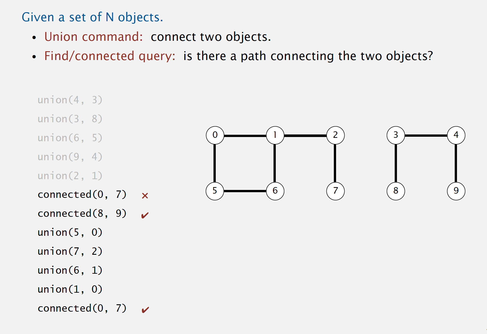

<br>

## Modeling

### Modeling the objects

Applications involve manipulating objects of all types:

- Pixels in a digital photo.
- Computers in a network.
- Friends in a social network.

  ...

When programming, convenient to name objects 0 to N –1.

- Use integers as array index

- Suppress details not relevant to union-find.

### Modeling the connections

We assume **is connected to** is an equivalence relation:

- Reflexive: p is connected to p.
- Symmetric: if p is connected to q, then q is connected to p.
- Transitive: if p is connected to q and q is connected to r, then p is connected to r.

**Connected components** - Maximal **set** of objects that are mutually
connected.


<br>

## Implementing the operations

### Find query

Check if two objects are in the same component

### Union command

Replace components containing two objects with their union


<br>

## Union-find data type (API)

Design efficient data structure for union-find

- Number of objects _N_ can be huge.

- Number of operations _M_ can be huge.

- Find queries and union commands may be intermixed.


<br>

## Dynamic-connectivity client

Read in number of objects N from standard input.

Repeat

- read in pair of integers from standard input

- if they are not yet connected, connect them and print out pair

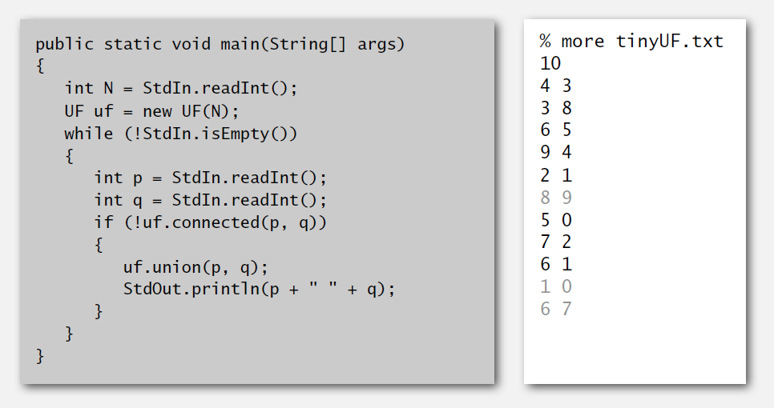

<br>

# Quick Find [eager approach]

## Data structure

- Integer array id[] of length N

- Interpretation: p and q are connected iff (if and only if) they have the same id


## Find

Check if p and q have the same id.

id[6] = 0; id[1] = 1
6 and 1 are not connected

## Union

To merge components containing p and q, change all entries whose id equals id[p] to id[q]


## Java implementation


## Too Slow

### Cost model

Number of array accesses (for read or write)


### Union is too expensive

It takes N^2 (quadratic) array accesses to process a sequence of
N union commands on N objects.

### Quadratic algorithms do not scale

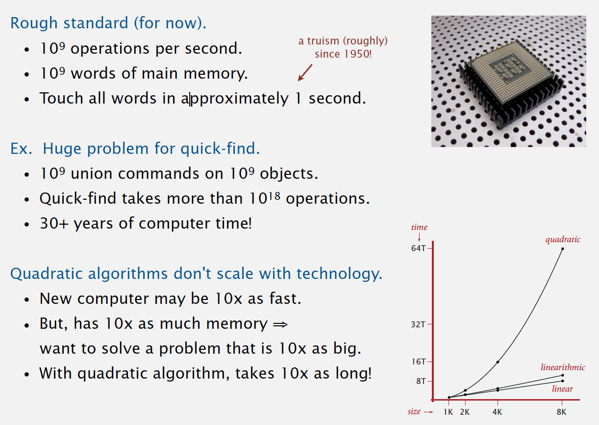

# Quick Union [lazy approach]

## Data structure

Integer array id[] of length N

Interpretation: id[i] is parent of i

Root of i is id[id[id[...id[i]...]]]

- keep going until it doesn’t change
  (algorithm ensures no cycles)


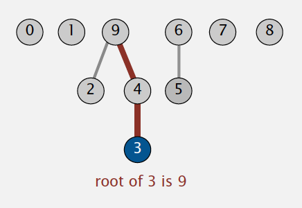

## Find

Check if p and q have the same root

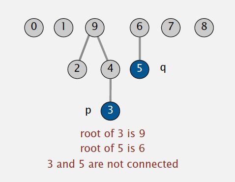

## Union

To merge components containing p and q, set the id of p's root to the id of q's root

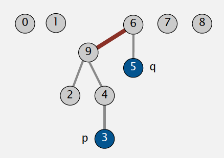


## Java Implementation

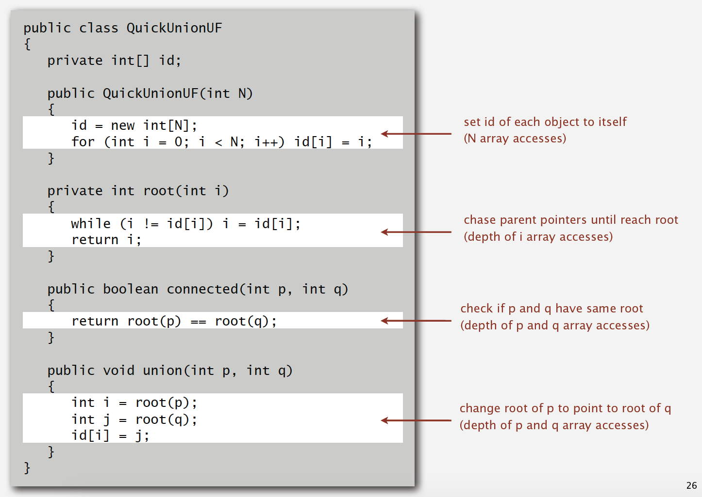

## Too slow

### Cost Model

Number of array accesses (for read or write).


### Quick-find defect

- Union too expensive (N array accesses)

- Trees are flat, but too expensive to keep them flat

### Quick-union defect

- Trees can get tall
- Find too expensive (could be N array accesses)

# Improvement 1: weighting

## Weighted quick-union

- Modify quick-union to avoid tall trees.
- Keep track of size of each tree (number of objects).
- Balance by linking root of smaller tree to root of larger tree.
  - reasonable alternatives:
    union by height or "rank"

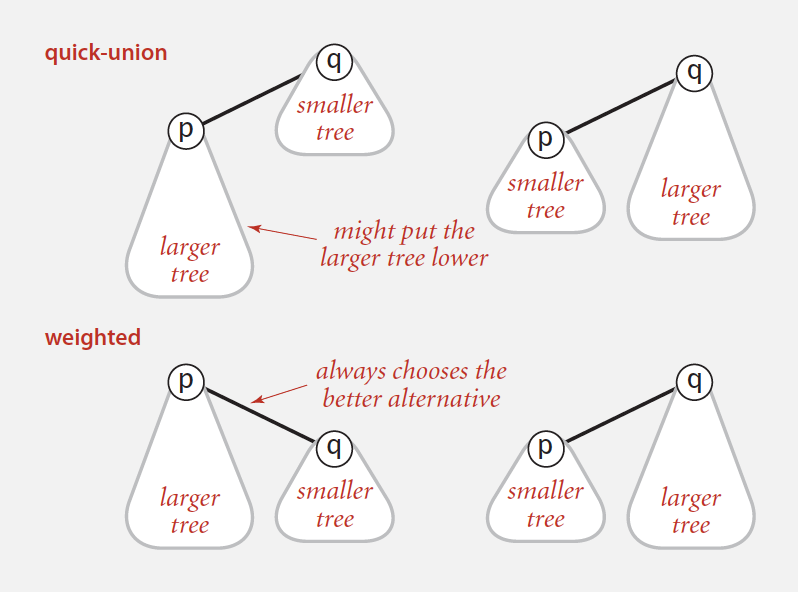

### Quick-union and weighted quick-union example

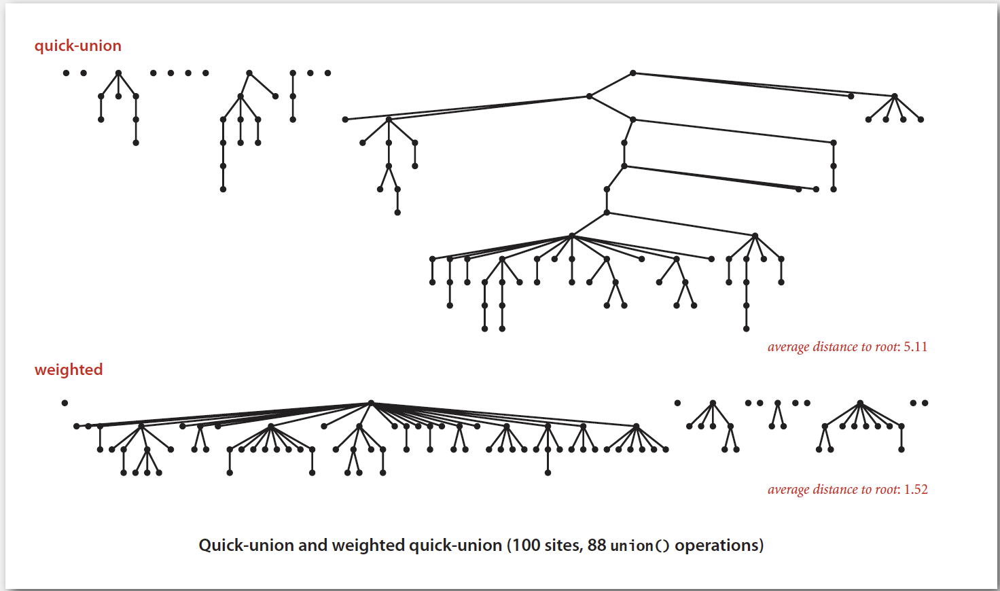

### Java implementation

#### Data structure

Same as quick-union, but maintain extra array sz[i]
to count number of objects in the tree rooted at i.

#### Find

Identical to quick-union

```java
return root(p) == root(q);
```

#### Union

Modify quick-union to:

- Link root of smaller tree to root of larger tree.
- Update the sz[] array.

```java
int i = root(p);
int j = root(q);
if (i == j) return;
if (sz[i] < sz[j]) { id[i] = j; sz[j] += sz[i]; }
else { id[j] = i; sz[i] += sz[j]; }
```

### Analysis

#### Running time

- Find: takes time proportional to depth of p and q

- Union: takes constant time, given roots.

#### Proposition

Depth of any node x is at most lg _N_

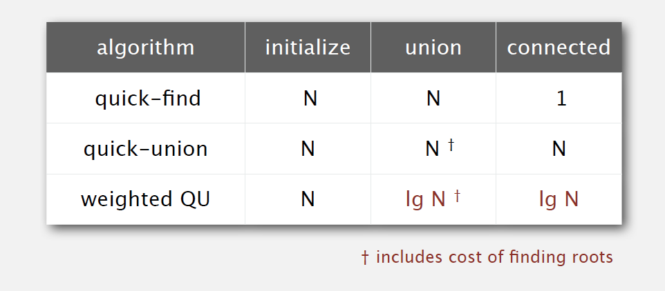

#### When does depth of x increase?

Increases by 1 when tree T1 containing x is merged into another tree T2

- The size of the tree containing x at least doubles since |T 2| ≥ |T 1|

- Size of tree containing x can double at most lg N times. Why?

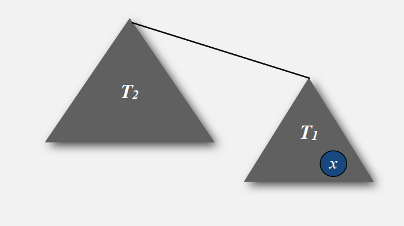

# Improvement 2: Path Compression

## Quick union with path compression

Just after computing the root of p, set the id of each examined node to point to that root
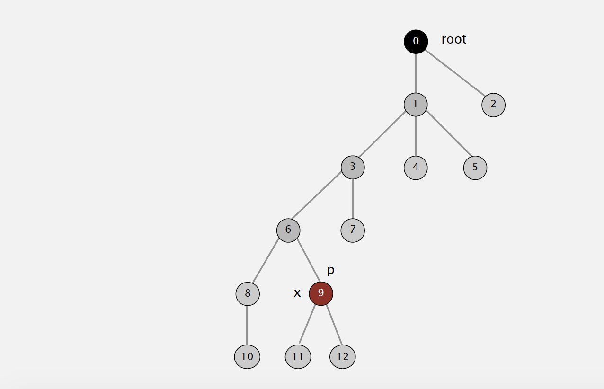
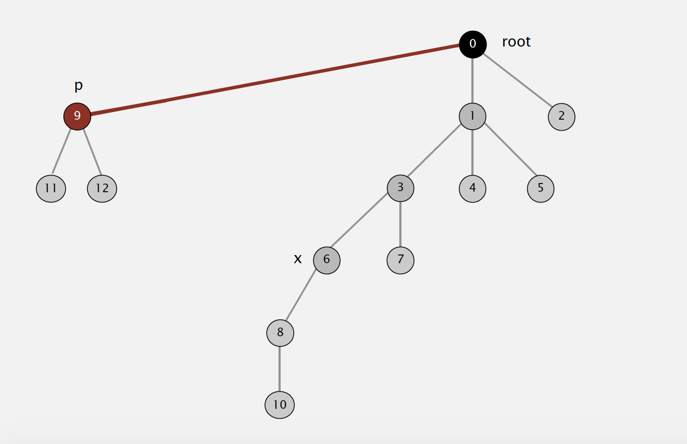
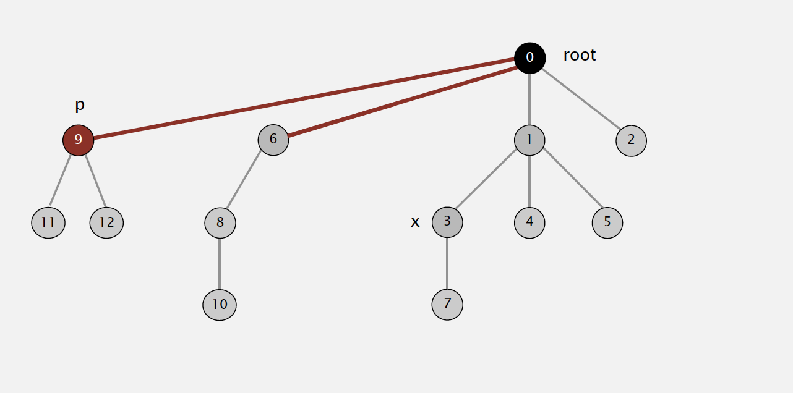
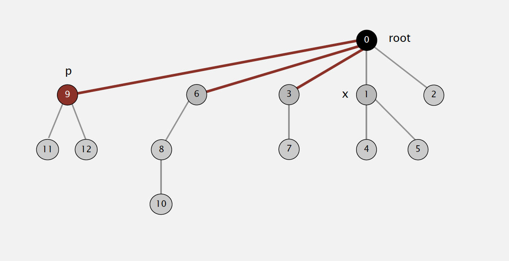
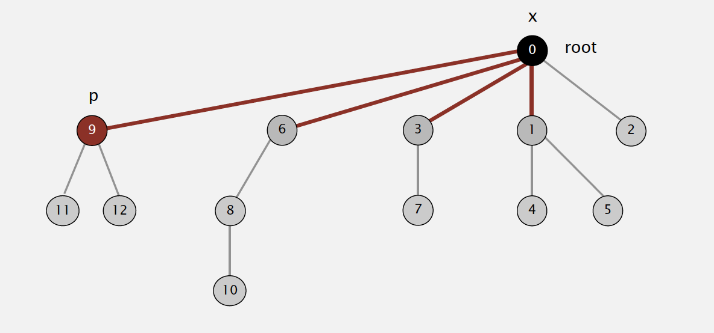

### Java implementation

#### Two-pass implementation

add second loop to root() to set the id[] of each examined node to the root

#### Simpler one-pass variant

Make every other node in path point to its grandparent (thereby halving path length)

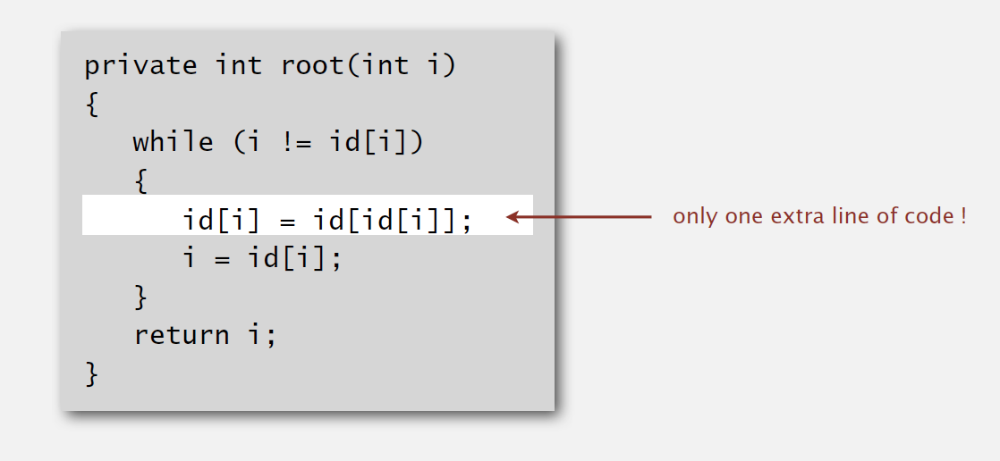

### Amortized Analysis

#### Proposition

Starting from an empty data structure, any sequence of M union-find ops on N objects makes ≤ c ( N + M lg \* N ) array accesses.

- Analysis can be improved to N + M α(M, N).

- Simple algorithm with fascinating mathematics.

#### Linear-time algorithm for M union-find ops on N objects?

- Cost within constant factor of reading in the data
- In theory, WQUPC is not quite linear
- In practice, WQUPC is linear

#### Amazing fact

No linear-time algorithm exists

# Summary

## Bottom line

Weighted quick union (with path compression) makes it possible to solve problems that could not otherwise be addressed

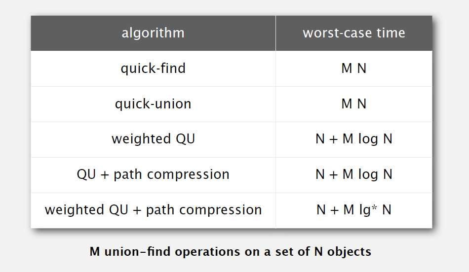

# Applications

- Percolation
- Games (Go, Hex)
- Dynamic connectivity
- Least common ancestor
- Equivalence of finite state automata
- Hoshen-Kopelman algorithm in physics
- Hinley-Milner polymorphic type inference
- Kruskal's minimum spanning tree algorithm
- Compiling equivalence statements in Fortran
- Morphological attribute openings and closings
- Matlab's bwlabel() function in image processing

## Percolation

A model for many physical systems

- N-by-N grid of sites
- Each site is open with probability p (or blocked with probability 1 – p).
- System **percolates** iff top and bottom are connected by open sites

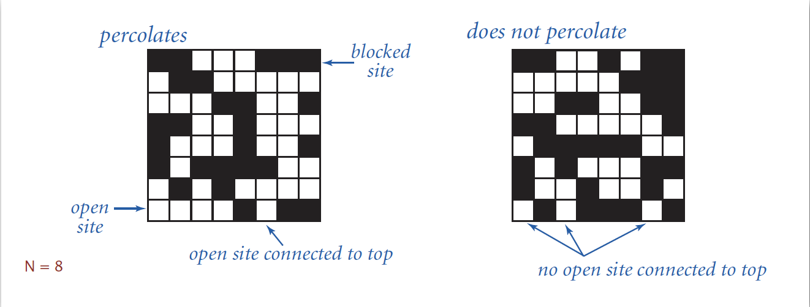

### Modeling


<br>

Depends on site vacancy probability p

### Percolation phase transition

When N is large, theory guarantees a sharp threshold p\*

- p > p\*: almost certainly percolates.

- p < p\*: almost certainly does not percolate.

What is the value of p\* ?
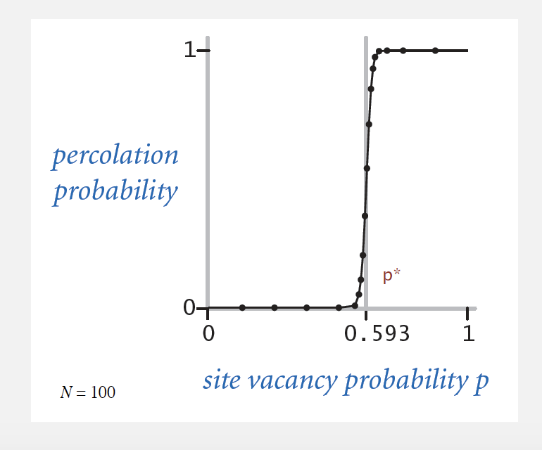

### Monte Carlo simulation

- Initialize N-by-N whole grid to be blocked

- Declare random sites open until top connected to bottom

- Vacancy percentage estimates p\*.

### Dynamic connectivity solution to estimate percolation threshold

#### How to check whether an N-by-N system percolates?

1. Create an object for each site and name them 0 to N^2 – 1

2. Sites are in same component if connected by open sites

3. Percolates iff any site on bottom row is connected to site on top row

- brute-force algorithm: N^2 calls to connected()

- Introduce 2 virtual sites (and connections to top and bottom)

  - Percolates iff virtual top site is connected to virtual bottom site
  - efficient algorithm: only 1 call to connected()

  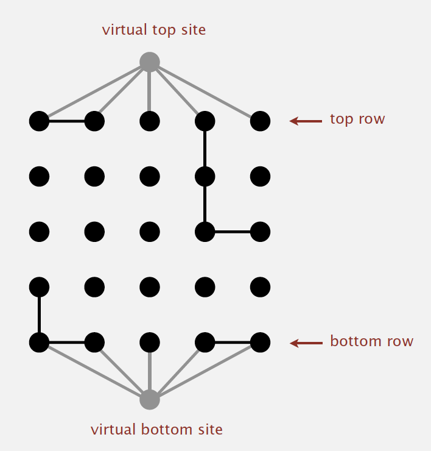

#### How to model opening a new site?

Mark new site as open; connect it to all of its adjacent open sites.

- up to 4 calls to union()

#### What is percolation threshold p\* ?

About 0.592746 for large square lattices.

- constant known only via simulation

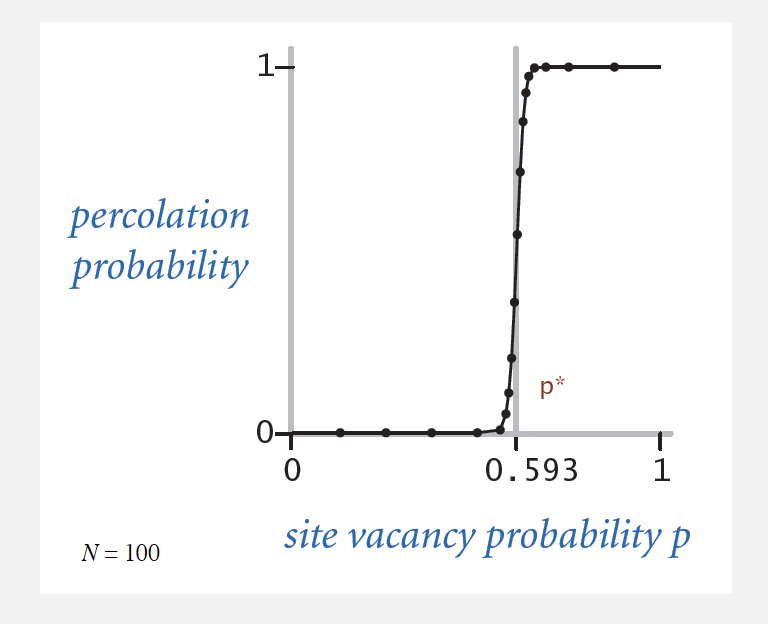
